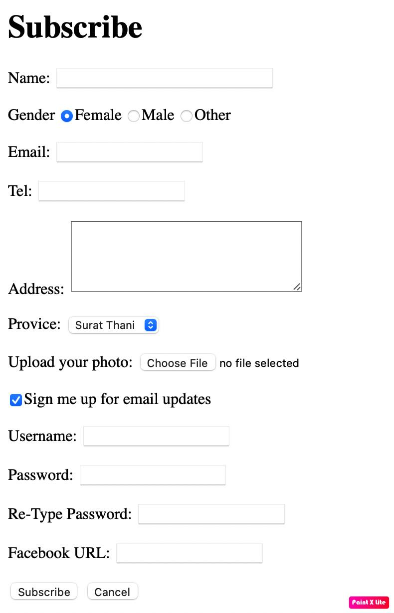

# Basic HTML

<!-- > Outline a brief description of your project.
> Live demo [_here_](https://www.example.com). If you have the project hosted somewhere, include the link here. -->

## Table of Contents

- [Heading](#heading)
- [Paragraph](#paragraph)
- [Image](#image)
- [Unorderlist](#underlist)
- [OrderList](#orderlist)
- [Link](#link)
- [Table](#table)
- [Form](#form)
<!-- * [License](#license) -->

## HTML5 Skeleton

```html
<!DOCTYPE html>
<html lang="en">
  <head>
    <title>Example document</title>
  </head>
  <body>
    <p>This is some text.</p>
    <p>This is more text.</p>
  </body>
</html>
```

## Heading

```html
<h1>Heading 1</h1>
<h2>Heading 2</h2>
<h3>Heading 3</h3>
<h4>Heading 4</h4>
<h5>Heading 5</h5>
<h6>Heading 6</h6>
```

  <h1>Heading 1</h1>
  <h2>Heading 2</h2>
  <h3>Heading 3</h3>
  <h4>Heading 4</h4>
  <h5>Heading 5</h5>
  <h6>Heading 6</h6>

## Paragraph

```html
<h1>Web Programming</h1>
<p>
  หลักการเขียนโปรแกรมเว็บ การพัฒนาโปรแกรมประยุกต์เว็บโดยใช้ภาษาที่นิยม
  ภาษาสคริปต์ ภาษาสาหรับการจัดรูปแบบเว็บ การพัฒนาเว็บเพื่อใช้งานฐานข้อมูล
  เฟรมเวอร์คสาหรับการพัฒนาเว็บ การฝึกปฏิบัติที่สอดคล้องกับรายวิชา
</p>

<p>
  Principles of web programming; web application development using popular
  languages; scripting languages, web formatting languages; web development for
  using database; framework for web development; practice corresponding with
  course
</p>
```

<h1>Web Programming</h1>
<p>
  หลักการเขียนโปรแกรมเว็บ การพัฒนาโปรแกรมประยุกต์เว็บโดยใช้ภาษาที่นิยม
  ภาษาสคริปต์ ภาษาสาหรับการจัดรูปแบบเว็บ การพัฒนาเว็บเพื่อใช้งานฐานข้อมูล
  เฟรมเวอร์คสาหรับการพัฒนาเว็บ การฝึกปฏิบัติที่สอดคล้องกับรายวิชา
</p>

<p>
  Principles of web programming; web application development using popular
  languages; scripting languages, web formatting languages; web development for
  using database; framework for web development; practice corresponding with
  course
</p>

## Image

The  element represents an image.
It doesn’t need an end tag,
The source image URL is specified by using the **src** attribute.

```html

```


source: Unsplash.com

## Unorderlist

- Unordered list is used as unordered list which consists of 2 tags: `<ul>` and `<li>`.
- `<ul>` represents a bulleted list of items.
- `<li>` represents a single item within the list. The browser will precede each list item with a bullet.

```html
<h2>Table of contents</h2>
<ul>
  <li>Teaching</li>
  <li>Researches</li>
  <li>Academic Services</li>
  <li>About Me</li>
</ul>
```

<h2>Table of contents</h2>
    <ul>
      <li>Teaching</li>
      <li>Researches</li>
      <li>Academic Services</li>
      <li>About Me</li>
    </ul>

## OrderList

- Unordered list is used as unordered list which consists of 2 tags: `<ol>` and `<li>`.
- `<ol>` represents a ordered list of items.
- `<li>` represents a single item within the list.
- An ordered list can be numerical or alphabetical

```html
<h2>Project 30%</h2>
<ol>
  <li>Web Design : Moodboard (5%)</li>
  <li>HTML + CSS + Resposive (5%)</li>
  <li>Working with DB (15%)</li>
  <li>TeamWork (5%)</li>
</ol>
```

## Link

Hyperlinks are links between documents which can be within your own site (relative links) or to external sites (absolute links).

`<a href="path">Text</a>`

### The target attribute can have one of the following values:

- \_self - Default. Opens the document in the same window/tab as it was clicked
- \_blank - Opens the document in a new window or tab
- \_parent - Opens the document in the parent frame
- \_top - Opens the document in the full body of the window


* A relative hyperlink
		
    ``<a href=“aboutus/index.html”>About Us </a>``

* An absolute hyperlink
		
    ``<a href=“http://www.google.com” target=“_blank”>Google</a>``


## Table

A table represents information in a grid format.

```html
<table border="2">
  <tr>
    <td>No.</td>
    <td>Name</td>
    <td>Score</td>
  </tr>
  <tr>
    <td>1</td>
    <td>Micheal</td>
    <td>89</td>
  </tr>
  <tr>
    <td>2</td>
    <td>Rose</td>
    <td>90</td>
  </tr>
  <tr>
    <td>3</td>
    <td>John</td>
    <td>60</td>
  </tr>
</table>
```
<table border="2">
  <tr>
    <td>No.</td>
    <td>Name</td>
    <td>Score</td>
  </tr>
  <tr>
    <td>1</td>
    <td>Micheal</td>
    <td>89</td>
  </tr>
  <tr>
    <td>2</td>
    <td>Rose</td>
    <td>90</td>
  </tr>
  <tr>
    <td>3</td>
    <td>John</td>
    <td>60</td>
  </tr>
</table>

## Form

- Form controls live inside a `<form>` element.
- action
  Every `<form>` element requires an action attribute.
  Its value is the URL for the page on the server that will receive the information in the form when it is submitted.
- method
  Form can be sent using one of two methods: **get** or **post**.

```html
<form action="http://www.example.com" method="post">
  <p>
    <label for="name">Name: </label>
    <input type="text" name="fullname" size="30" maxlength="15" />
  </p>

  <p>
    <label for="gender">Gender</label>
    <input type="radio" name="gender" value="female" checked />Female
    <input type="radio" name="gender" value="male" />Male
    <input type="radio" name="gender" value="other" />Other
  </p>

  <p>
    <label for="email">Email: </label>
    <input type="email" name="email" />
    <!--กำหนดรูปแบบให้เป็น email format-->
  </p>

  <p>
    <label for="tel">Tel: </label>
    <input
      type="tel"
      name="tel"
    /><!--กำหนดรูปแบบให้โทรศัพท์ เป็นตัวเลขเท่านั้น-->
  </p>

  <p>
    <label for="address">Address: </label>
    <textarea name="address" cols="30" rows="5"></textarea>
  </p>

  <p>
    <label for="province">Provice: </label>
    <select name="provice">
      <option value="Bangkok">Bangkok</option>
      <option value="Surat Thani" selected>Surat Thani</option>
      <option value="Phuket">Phuket</option>
    </select>
  </p>

  <p>
    <label for="photo">Upload your photo: </label>
    <input type="file" name="photo" />
  </p>

  <p>
    <input type="checkbox" name="signup" value="1" checked />Sign me up for
    email updates
  </p>
  <p>
    <label for="username">Username: </label>
    <input type="text" name="username" />
  </p>
  <p>
    <label for="password">Password: </label>
    <input type="password" name="password" />
  </p>

  <p>
    <label for="password">Re-Type Password: </label>
    <input type="password" name="re_password" />
  </p>

  <p>
    <label for="facebook">Facebook URL: </label>
    <input type="url" name="facebook" />
  </p>

  <p>
    <input type="submit" value="Subscribe" />
    <input type="reset" value="Cancel" />
  </p>
</form>
```


<!--  -->

* ตัวอย่าง Source Code: - [Basic HTML](index.html)
* ตัวอย่างเว็บไซต์ [Web portfolio](https://2018patty.github.io/web_programming_portfolio/)
* ตัวอย่าง Source Code Form: [Form](subscribe.html)

## Contact

Pattaraporn Warintarawej

31 Moo 6 Makamtai District, Muang, Surat Thani, Thailand 84000<br>
Faculty of Sciences and Industrail Technology<br>
Prince of Songkla University, Surat Thani Campus
